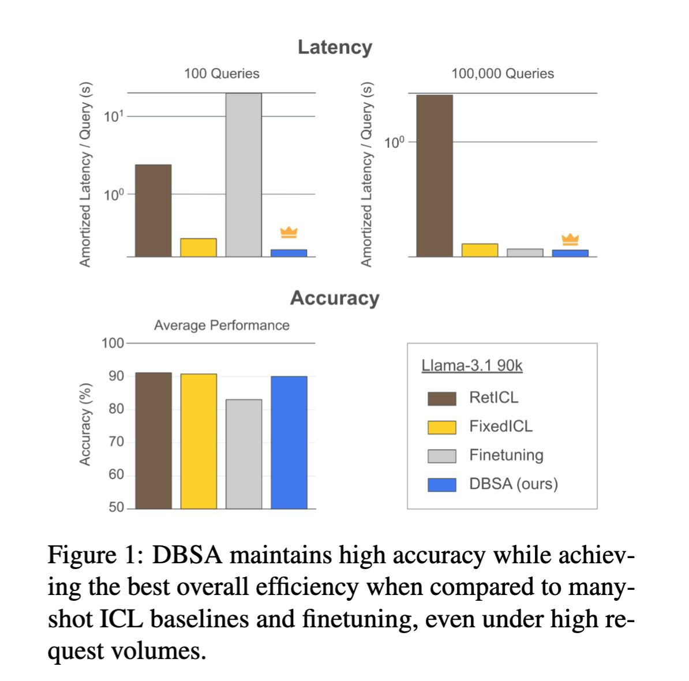

# Efficient Many-Shot In-Context Learning with Dynamic Block-Sparse Attention (DBSA)

This repository contains the code for paper "Efficient Many-Shot In-Context Learning with Dynamic Block-Sparse Attention". 



## Quick Start
- Create a Conda environment with python 3.10+
- Install dependencies using `env.yml`
- To enable DBSA, replace `modeling_llama.py` with `replacement_modeling_llama.py`, and `modeling_utils.py` with `replacement_modeling_utils.py`. You can find the path with:
```bash
python -c "import transformers; print(transformers.__path__)"
```
- Run DBSA with desired arguments. Example:
```bash
python run_evaluation.py \
--dataset banking77 \
--model togethercomputer/LLaMA-2-7B-32K \
--subsample-test-set 250 \
--n-runs 1 \
--n-shots-per-window 50 \
--n-windows 16 \
--block-select-method bm25 \
--n-selected-blocks 5 \
--attn-prev-blocks 2 \
--attn-sink-blocks 1 \
--fp16 \
--output-dir ./out
```

## Running experiments from paper
- Run main experiments: `exp-main-*.sh`
- Run ablation experiments: `exp-abl-*.sh`
- Run fine-tuning experiments: scripts available in the `finetuning` folder


## How to add a new dataset
DBSA supports both **classification** and **generation** datasets. Follow these steps to integrate a new dataset:

### 1. Define the dataset in `datasets_loader.py`
Create a class and specify dataset attributes:
```
class TREC(ClassificationDatasetAccess):
    name = 'trec' # load from https://huggingface.co/datasets/CogComp/trec 
    orig_y_label = 'coarse_label' # label column name in dataset
    x_prefix = "Question: "
    y_prefix = "Type: "
    label_mapping = {0: "abbreviation", 1: "entity", 2: "description", 3: "human", 4: "location", 5: 'numeric'}
```
For generation dataset, set `map_labels = False`
```
class SAMSUM(ClassificationDatasetAccess):
    name = 'Samsung/samsum'
    x_prefix = 'Conversation: '
    y_prefix = 'Summary: '
    map_labels = False
    orig_x_column = 'dialogue'
    orig_y_label = 'summary'
```

### 2. Register the Dataset
In the same file (`datasets_loader.py`), add the dataset to the loader dictionary:
```
DATASET_NAMES2LOADERS["trec"] = TREC
DATASET_NAMES2LOADERS["samsum"] = SAMSUM
```

### 3. Run the evaluation script
Test the dataset by setting the `--dataset` flag
```
python run_evaluation.py \
--dataset trec \
...
```

### 4. Custom evaluation (optional)
Results will be saved as a CSV in `output-dir`. You can apply any post-hoc evaluation with your own metric of choice.


## Citation


## Acknowledgments
This codebase builds upon the following papers
```
@misc{bertsch2024incontext,
      title={In-Context Learning with Long-Context Models: An In-Depth Exploration}, 
      author={Amanda Bertsch and Maor Ivgi and Uri Alon and Jonathan Berant and Matthew R. Gormley and Graham Neubig},
      year={2024},
      eprint={2405.00200},
      archivePrefix={arXiv},
      primaryClass={cs.CL}
}

@misc{ratner2023parallel,
      title={Parallel Context Windows for Large Language Models}, 
      author={Nir Ratner and Yoav Levine and Yonatan Belinkov and Ori Ram and Inbal Magar and Omri Abend and Ehud Karpas and Amnon Shashua and Kevin Leyton-Brown and Yoav Shoham},
      year={2023},
      eprint={2212.10947},
      archivePrefix={arXiv},
      primaryClass={cs.CL}
}
```
